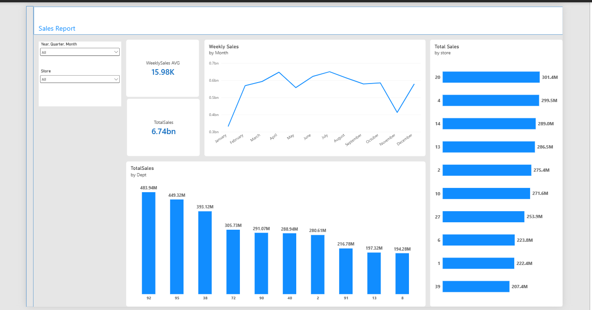

# Walmart Sales Analysis & Dashboard

A complete analysis of Walmart sales data using SQL Server for data cleaning and analysis, and Power BI for building an interactive dashboard.

## Project Overview

This project covers a full data analysis workflow:
1. **Data Cleaning** using SQL Server
2. **Statistical Analysis** (patterns, comparisons, correlation)
3. **Interactive Dashboard** using Power BI

## Tools Used

- **SQL Server (SSMS)** - Data cleaning and analytical queries
- **Power BI Desktop** - Dashboard building and DAX calculations

## Workflow

### 1. Data Cleaning (SQL)
- Handled missing values in MarkDown1-5, Unemployment and CPI columns
- Converted column data types (text to numeric/decimal)
- Cleaned non-numeric text values from numeric columns

### 2. Analytical Views (SQL)
- Best and worst performing month by sales
- Impact of holidays on weekly sales
- Best and worst performing stores
- Top performing departments by sales

### 3. Dashboard (Power BI)
The dashboard includes:
- KPI Cards: total sales and average weekly sales
- Monthly sales trend (Line Chart)
- Top 10 stores by total sales
- Sales comparison by department
- Interactive filters by year and store

## Files in this Repository

| File | Description |
|---|---|
| `walmart_features_cleaned.csv` | Cleaned features data |
| `walmart_train_cleaned.csv` | Cleaned sales data |
| `BestWorstMonth.csv` | Best/worst month analysis |
| `BestWorstStore.csv` | Best/worst store analysis |
| `walmart_sales_dashboard.pbix` | Full Power BI dashboard file |
| `dashboard_preview.png` | Dashboard preview image |

## Dashboard Preview

## Key Insights

- Correlation analysis between economic variables (CPI, Unemployment, Fuel Price) and weekly sales showed weak statistical relationships, suggesting that seasonal factors (holidays, markdowns) have a stronger influence on sales than general economic conditions.
